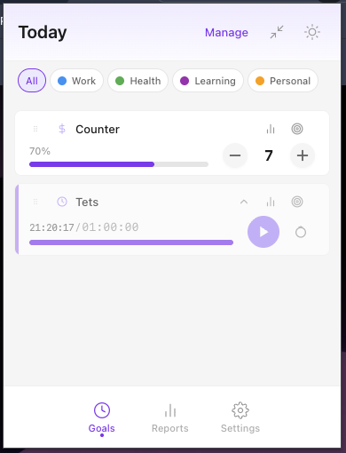
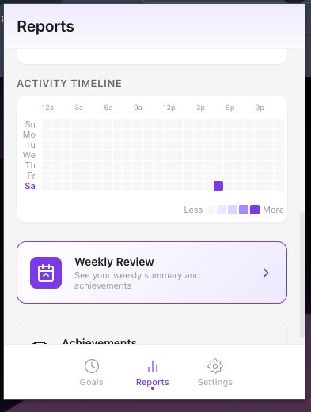
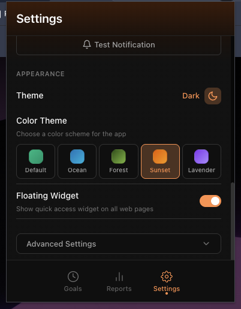
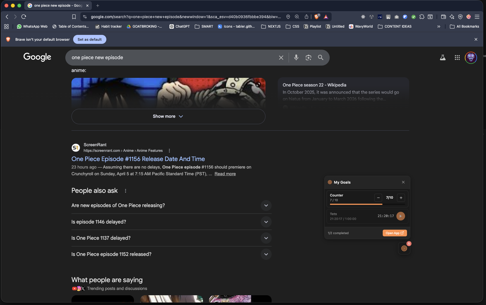

<div align="center">

# My Tracker

**A Chrome extension to track daily goals with timers, counters, and checkboxes.**
**Stay disciplined. Build streaks. Crush your goals.**

[](https://github.com/abdushsk/my-tracker)
[](https://developer.chrome.com/docs/extensions/mv3/)
[](LICENSE)

<br>

&nbsp;&nbsp;&nbsp;
&nbsp;&nbsp;&nbsp;


</div>

---

## Features

### Goal Types
- **Timer** -- Track time-based goals (e.g., study for 3 hours) with play, pause, and reset controls
- **Counter** -- Track count-based goals (e.g., complete 10 tasks) with increment/decrement buttons
- **Checkbox** -- Simple completion goals (e.g., meditate) with toggle functionality

### Timeframes
- **Daily** (resets at midnight) | **Weekly** (resets on Monday) | **Monthly** (resets on the 1st) | **Yearly** (resets on Jan 1st)

### Reports & Analytics
- Discipline score tracking and streak counters
- Activity heatmaps and weekly completion charts
- Weekly review with summary and achievements
- Completion statistics by goal type and category

### Floating Widget
Access your goals from any webpage without opening the extension popup.

<div align="center">

<br>
<em>Quick-access floating widget overlays on any webpage</em>
</div>

### More
- **Pomodoro Mode** -- Built-in 25/5 work-break cycles
- **Focus Mode** -- Distraction-free timer interface
- **Achievements** -- Unlock badges for milestones like streaks and completions
- **Daily Challenges** -- Extra motivation with bonus goals
- **Sound Effects** -- Satisfying audio feedback
- **Themes** -- Light, dark, auto modes with multiple color themes (Ocean, Forest, Sunset, Lavender)
- **Categories** -- Organize goals by Work, Health, Learning, Personal, and custom categories
- **Keyboard Navigation** -- Full keyboard support for accessibility
- **Data Export/Import** -- Backup and restore your data as JSON
- **Notifications** -- Reminders and achievement alerts

---

## Installation

### From Source (Developer Mode)

1. **Clone the repository**
   ```bash
   git clone https://github.com/abdushsk/my-tracker.git
   ```

2. **Open Chrome Extensions page**
   Navigate to `chrome://extensions/` or `brave://extensions/`

3. **Enable Developer Mode**
   Toggle the "Developer mode" switch in the top right corner

4. **Load the extension**
   Click "Load unpacked" and select the project root folder (containing `manifest.json`)

5. **Pin the extension** (optional)
   Click the puzzle piece icon in Chrome's toolbar and pin "My Tracker"

### Updating

1. Pull the latest changes with `git pull`
2. Go to `chrome://extensions/` and click the refresh icon on the My Tracker card

---

## Project Structure

```
my-tracker/
├── manifest.json              # Chrome extension manifest (v3)
├── src/
│   ├── assets/
│   │   ├── icons/             # Extension icons
│   │   └── sounds/            # Audio feedback files
│   ├── background/
│   │   └── service-worker.js  # Background service worker
│   ├── content/
│   │   └── widget.js          # Floating widget (content script)
│   ├── popup/
│   │   ├── popup.html         # Main popup UI
│   │   ├── popup.js           # Main popup logic
│   │   ├── popup.css          # Styles
│   │   ├── screens/           # Screen components
│   │   ├── features/          # Feature modules
│   │   ├── utils/             # Utility functions
│   │   └── themes/            # Theme configurations
│   ├── styles/                # Shared styles
│   └── utils/                 # Shared utilities
└── docs/
    └── screenshots/           # App screenshots
```

## Permissions

| Permission | Purpose |
|---|---|
| `storage` | Save goals and progress data locally |
| `alarms` | Schedule goal resets and reminders |
| `notifications` | Send reminder and achievement notifications |
| `contextMenus` | Right-click menu integration |

---

## License

MIT License
